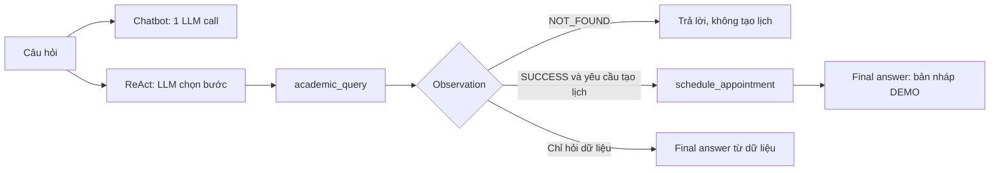

# Lab 3 — Chatbot baseline vs ReAct Agent

**Học viên:** NGUYỄN VĂN DUY · **MSSV:** 2A202602729<br>
**Lớp:** K4A · **Đề tài:** Trợ lý học vụ DEMO tra cứu sinh viên và tạo bản nháp lịch tư vấn<br>
**Nguồn bài lab:** [Starter repo K4A MCP Enhanced](https://github.com/VinUni-AI20k/K4A-Day03-Lab-Chatbot-vs-ReAct-Agent-MCP)

**Trạng thái nộp:** Đã nộp [link repo này trên VLearn](https://vlearn.dev/labs) lúc
12:49:11 ngày 13/09/2026. Form ghi đánh giá 5/5 sao do học viên chọn; đây chưa phải
điểm chấm của giảng viên.

Repo này giữ cùng một use case cho hai hệ thống. Chatbot baseline trả lời bằng một lần
gọi LLM, không có công cụ. ReAct agent được gọi native functions qua adapter MCP-style:
`academic_query` đọc hồ sơ DEMO; `schedule_appointment` tạo bản nháp lịch DEMO khi
đã tra cứu thành công và biết đúng cố vấn. Sau mỗi tool call, observation được nối vào
hội thoại trước lần gọi LLM kế tiếp. Vì vậy TC04 thực sự có hai bước phụ thuộc nhau.

**Ranh giới:** Dữ liệu sinh viên trong `src/tools.py` là giả lập. Lịch chỉ được lưu trong
bộ nhớ phiên demo, **không** gửi tới VinUni. `src/mcp_server.py` là adapter mô phỏng
MCP/JSON-RPC trong cùng tiến trình theo starter repo, chưa phải MCP server mạng.
Lượt nghiệm thu dùng **OpenAI API thật**; không có key nào được commit.

## Vì sao use case này hợp với agent?

| Tiêu chí | Điểm / 5 | Dẫn chứng |
| --- | ---: | --- |
| Multi-step Reasoning | 4 | Tra cứu → lấy cố vấn → tạo bản nháp lịch. |
| Tool Interaction | 5 | Một tool đọc dữ liệu, một tool ghi bản nháp. |
| Dynamic Decision | 4 | `NOT_FOUND` thì dừng; `SUCCESS` mới được đặt với đúng cố vấn. |
| Long Horizon | 2 | Giữ mục tiêu vài vòng trong một request; không có memory dài hạn. |
| **Tổng** | **15/20** | Trên ngưỡng 12/20 trong mẫu nghiệm thu. |

Bảng **3 tiêu chí của slide** tương ứng đạt **13/15**, nằm trong nhóm “agent đáng thử”.
Hai câu hỏi đơn giản vẫn đi đường chatbot/no-tool; bài không giả định agent thắng mọi lúc.

## Chạy trên Windows PowerShell

Python 3.10–3.12. Nếu đã có biến môi trường Windows `OPENAI_API_KEY`, chỉ cần file `.env`
với `LLM_PROVIDER=openai` và `LLM_MODEL=gpt-4.1-mini`. Có thể đặt key trong `.env`
địa phương nếu cần; `.env` đã nằm trong `.gitignore`.

```powershell
python -m venv .venv
.\.venv\Scripts\python.exe -m pip install -r requirements.txt
Copy-Item .env.example .env  # Chỉ khi chưa có .env
.\.venv\Scripts\python.exe src/app.py --all --mock
.\.venv\Scripts\python.exe src/app.py --all
.\.venv\Scripts\python.exe -m unittest discover -s tests -v
```

`--mock` là kiểm tra logic miễn phí; **không dùng kết quả Mock để nộp nghiệm thu**.
Lệnh không có `--mock` gọi OpenAI thật và ghi:

- [`docs/trace_waterfall.json`](docs/trace_waterfall.json): chuỗi tool call, observation,
  final answer, latency và ID phản hồi API;
- [`docs/test_results.json`](docs/test_results.json): cùng 5 câu hỏi chạy qua baseline và
  agent, kỳ vọng/đầu ra thực tế, thời gian và kết quả PASS/FAIL;
- [`docs/trace_eval.md`](docs/trace_eval.md): báo cáo nghiệm thu có bảng Agentic Fit,
  trích trace thật và nhận định.

Để thử câu hỏi trực tiếp:

```powershell
.\.venv\Scripts\python.exe src/app.py --interactive
```

## Giao diện demo

```powershell
.\.venv\Scripts\python.exe src/web_ui.py
```

Mở **http://127.0.0.1:8765** trên chính máy chạy lệnh. Giao diện hiển thị hai câu
trả lời cạnh nhau và waterfall trace; có sẵn nút cho câu đơn giản, tra cứu và ca biên.
Đây là UI địa phương để trình chiếu, không phải bản triển khai công khai.
Ảnh chụp một lượt UI gọi API thật và đi qua hai tools: [docs/ui_live.png](docs/ui_live.png).



[Sơ đồ đầy đủ và các điều kiện dừng](docs/flowchart.md).

## Kết quả nghiệm thu

Lượt cuối với **OpenAI `gpt-4.1-mini`**: **5/5 PASS**, **4 tool calls** đúng.

| Ca | Nhóm | Hành vi của agent |
| --- | --- | --- |
| TC01, TC02 | chatbot đủ | Trả lời trực tiếp, không gọi tool. |
| TC03 | agent có giá trị | `academic_query → SUCCESS`; trả GPA/cố vấn từ dữ liệu. |
| TC04 | agent có giá trị | `academic_query → schedule_appointment → final`; đúng cố vấn từ observation. |
| TC05 | ca biên | `academic_query → NOT_FOUND`; không tạo lịch. |

Median độ trễ của 5 câu: baseline **1273.91 ms**, agent **2609.84 ms**. Mẫu nhỏ và
TC01 baseline chậm hơn agent, nên chỉ dùng thời gian như số đo tham khảo, không kết luận
về hiệu năng tổng quát. Baseline không thể xác minh dữ liệu hoặc tạo lịch; agent có thể
làm việc đó **trong bộ dữ liệu demo**. Chi tiết từng câu và đầu ra thật ở báo cáo.

## Tự kiểm theo rubric

- **Agentic Fit & Tool Specs (25%):** Bảng 4 tiêu chí, 2 JSON Schemas có mô tả input,
  điều kiện sử dụng và kiểm tra lỗi.
- **ReAct Loop & MCP Integration (35%):** Native tool calling với OpenAI thật;
  observation được đưa trở lại model, tối đa 5 vòng.
- **Trace & Observation (25%):** Waterfall trace cho cả 5 ca, có ca chuỗi 2 tools và
  ca `NOT_FOUND`. Trường `thought` chỉ là tóm tắt quyết định công khai, không phải
  chain-of-thought ẩn.
- **Repo & Submission (15%):** Code, 5 test cases, báo cáo, sơ đồ và UI demo nằm trong
  repo cá nhân; nộp link repo trên VLearn.

Guardrails: chặn lặp lại cùng tool/args; validate tham số JSON; không tạo lịch khi
chưa tra cứu, sai cố vấn hoặc sai định dạng giờ; không có fallback âm thầm từ API thật
sang Mock. Để dùng ngoài demo phải thêm xác thực, phân quyền, nguồn dữ liệu được phép,
kiểm tra lịch trống và xác nhận người dùng trước thao tác ghi thật.
