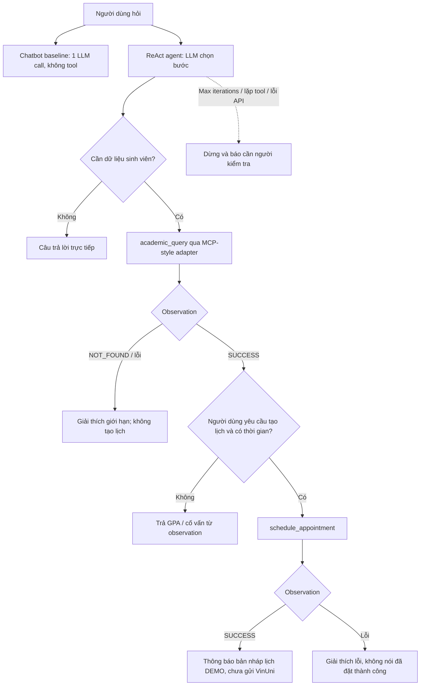

# Luồng xử lý: chatbot baseline và ReAct agent

Hai nhánh nhận cùng một câu hỏi trong 5 ca kiểm thử. Agent nối `assistant tool_call` và
`tool observation` vào hội thoại trước lần gọi LLM kế tiếp; TC04 vì vậy có chuỗi quan sát
được `academic_query → schedule_appointment → final answer`. Không suy diễn rằng hệ thống
đã gọi dữ liệu hoặc đặt lịch thật ở VinUni: cả hai tool dùng bộ dữ liệu giả lập trong repo.
